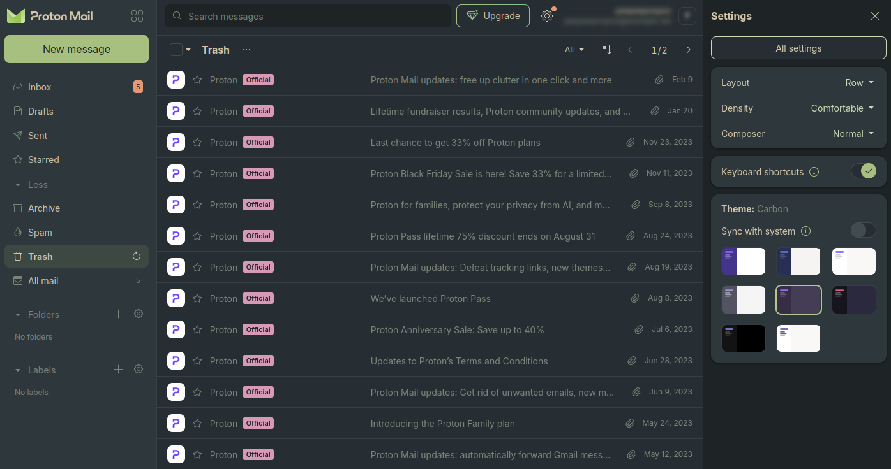

# Evernote for Proton

Evernote colors for [Proton Mail](https://github.com/ProtonMail), Proton Drive, Proton Calendar.

Supports both variants (dark, light) and three contrast settings (soft, medium, hard). You can also hide the _Upgrade_ call-to-action button.

## Usage

1. Set your Proton theme to **Carbon**.
2. Add the [Stylus extension](https://github.com/openstyles/stylus) to your browser.
3. Visit [this link](https://github.com/isaac-8601/proton-everforest/raw/main/everforest.user.css) and click the install button.
4. Set your preferred palette settings.

## Thanks to

- [soya-daizu](https://github.com/soya-daizu) and [jorismertz](https://github.com/jorismertz) for creating the [Catpuccin](https://github.com/catppuccin/userstyles/tree/main/styles/proton) and [Rosé Pine](https://github.com/rose-pine/userstyles/tree/main/proton) styles, respectively, which were useful in translating Proton to the Everforest palettes.